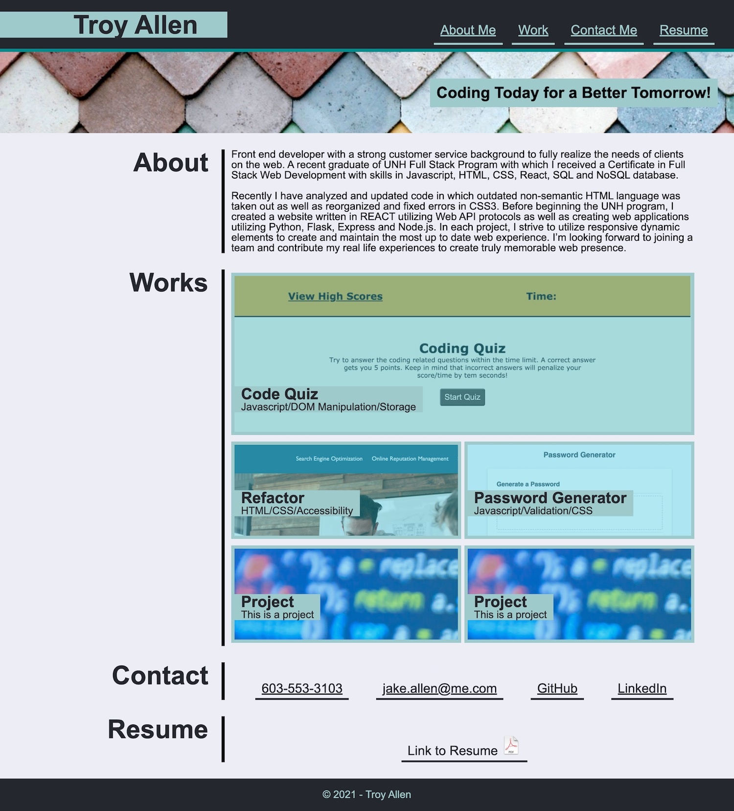

# Week-2-Homework

## Your Task

Create a Personal Portfolio online to showcase pertinant information about you, provide contact info and provide links and information regarding past projects completed.

## Criteria
- Create page using HTML5 Semantic language and CSS3 protocols.  Making sure to comment and organize code.
- Utilize Navigation links to scroll the UI to the various sections located on the page.
- Include a subtitle with a banner and witty statement.
- Include visual links to projects that bring the user to a functioning version of said project.
    - First project should be larger than the rest to imply importance.
    - Following projects should be responsive.
    - Secondary projects can be placeholders to be added later.
- Include section for About Me, Contact Info, Resume, and Works.
- Format the page in a responsive way as to conform to multiple user devices.

## Final Product

    https://tallen1985.github.io/Portfolio